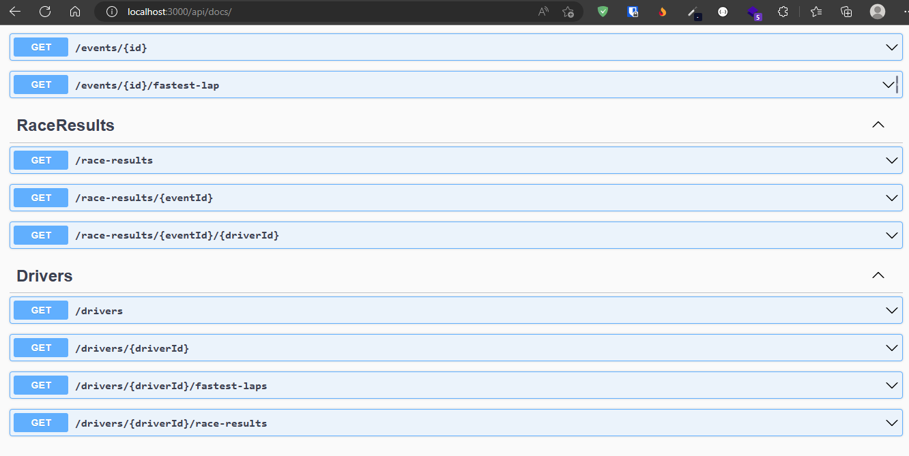

# F1 World API & Database

Welcome to one of the largest open database on Formula 1. A SQLite database and a Node.js API ready to be used with race results, teams, times per lap, pit stops, free-practices and much more!

<!-- TABLE OF CONTENTS -->
<details>
  <summary>Table of Contents</summary>
  <ol>
    <li>
      <a href="#run-the-api-">Run the code locally</a>
      <ul>
        <li><a href="#prerequisites">Prerequisites</a></li>
        <li><a href="#installation">Installation</a></li>
      </ul>
    </li>
    <li>
      <a href="#manage-the-database-">Manage the database</a>
    </li>
    <li>
      <a href="#contributing-">Contributing</a>
      <ul>
        <li><a href="#why-to-contribute">Why to contribute?</a></li>
      </ul>
    </li>
    <li><a href="#contact">Contact</a></li>
  </ol>
</details>

## Run the API locally 🚀

The following explains how to run the API locally. This way you will be able to investigate on your own how it is done, create new features, fix bugs or use it in your projects.

### Prerequisites

The API has developed in Node and TypeScript, so you will need to have installed Node. Consult [here](https://nodejs.org/en/download/) your installation options. To create the database and to import/export data from it, you must install Python (a version greater than `3.10` if possible). You should also have git installed in your machine.

### Installation

Open a terminal on your computer and go to the folder where you want to place the project. Then clone the project and install the dependencies by typing the following commands:

```
git clone https://github.com/enrique-lozano/F1-World-API.git
```

```
cd F1-World-API
```

```
npm install
```

If everything went correctly these commands will finish executing without errors.

### Create the database in SQLite

Now you will have to create the database on your machine, otherwise when running the API it will not find any data. To do this, with python correctly installed, run the following commands:

```
cd data
```

```
python import_to_sqlite.py
```

### Start the server

Now you are already finishing! It only remains to prove that everything goes as it should. For that, you can run <code>npm run start</code> on your terminal. When this command finish, you can start receiving data from the API. Try to put http://localhost:3200/api/drivers/adrian-sutil in your favorite browser. You should see how the information of this driver in JSON format is shown:


To see the avalaible routes (or API calls) that you can access, you can go to our [swagger documentation](http://localhost:3200/api/docs). Here you will have described all the calls you can make, their parameters, etc.



## Manage the database 🗂️

If you want to collaborate by adding/correcting records in our database or simply see how we have organized all the information, you can go to this [directory](https://github.com/enrique-lozano/F1-World-API/blob/main/data/README.md). In it, you will find all the necessary information, and if you have any questions, do not hesitate to ask!

## Contributing 🙋🏻

Contributions are what make the open source community such an amazing place to learn, inspire, and create. Any contributions you make here are **greatly appreciated**.

Read through our [contributing guidelines](https://github.com/enrique-lozano/F1-World-API/blob/main/CONTRIBUTING.md) to learn about how you can collaborate making this API better. **All Pull Requests are welcome** and will be studied without exception!

### Why to contribute?

- We can learn for you and you can learn from us.
- You'll appear in our contributors wall.
- You can **include it in your CV/LinkedIn** and show recruiters that you contribute to open-source projects.
- You'll make Monekin better.
- You can develop the features that you miss in the app yourself, the way you want them.
- You'll play around and learn cutting-edge technologies.
